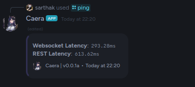
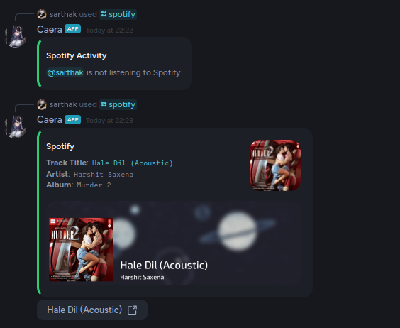

Commands related to the bot and general user commands that don't fit in a specific category.

## Commands

### ping

Checks the latency of bot.

**Usage**: `/ping`

### spotify

View spotify activity of an member

**Usage**: `/spotify <member> <background>`

#### Arguments

* `member`: The member to check activity of
* `background`: The background to display in embed image

